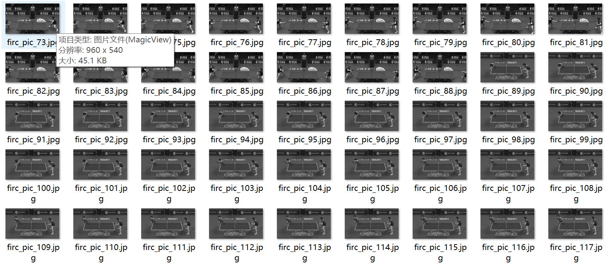
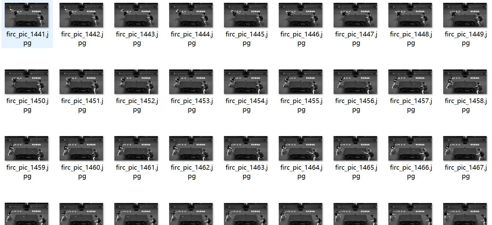

# Ping Pong Table Tennis Position Detection Dataset VOC+YOLO format with 2613 images and 5 categories

The dataset format is Pascal VOC format + YOLO format. It does not include the split path in the txt file, but only contains the jpg image and corresponding VOC format xml file and YOLO format txt file.
number of images: 2613  
The number of XML files is 2613.
annotation count: 2613  
annotationnumber of classes: 5  
The labeled categories are: ["ball placement", "negative slope", "other", "positive slope", "zero slope"]
boxes per class:   
The number of frames for ball placement is 43.
Negative slope (negative slope) box count = 845
Other (other) box count = 866
Positive slope (positive slope) box count = 630
The slope of zero is undefined, as it represents an inflection point where the graph changes direction. Therefore, there is no frame number associated with a zero slope.
total boxes: 2613  
images per class:   
The number of images that contain the ball placement is 43.
The negative slope (negative gradient) has 845 images.
The other (other) number of pictures is 866.
The positive slope, which is represented as "positive slope", refers to an area or terrain that has a steep upward incline. It indicates that the direction of the slope is towards the top, with the highest point being at the top and the lowest point at the bottom.

In terms of imagery, a positive slope can be represented by a landscape where there is a significant elevation difference between the ground level and the top of the landform. This can include hills, mountains, or other geographical features that have a pronounced uphill aspect.

To quantify this visual representation, one might use a metric called slope angle, which measures the angle between the horizontal plane and the line connecting the two points on the slope. The more steep the slope, the greater the angle between these two lines.

When it comes to data analysis or modeling, the number of images representing a positive slope could be interpreted as the total count of such features or phenomena within a given region or dataset. For example, if we have a dataset of images labeled as "mountains," "hills," or "riverbeds," and we are interested in identifying areas with positive slopes, we would tally the number of images that fall into each category, resulting in a total count of 630 images representing positive slopes.
The slope of the zero-slope is 229.
image resolution: 960x540  
Use annotation tool: labelImg
The marking rules: Drawing a rectangle around the category.
Important Note: The dataset does not have split into training validation test sets, so you need to do it yourself.
Special Disclaimer: This dataset does not guarantee the accuracy of the trained model or weight files.
Preview image:
## Images

Here is a pay link on Stripe ( https://buy.stripe.com/3cs8yP7sY87d0vu9AB ). Please contact me lonlonago@foxmail.com after funding $89, and I will send you a complete data files , thank you!

